<div align="center">

# Tax Flow Georgia 🇬🇪

**A no-backend personal finance tool for individual entrepreneurs in Georgia.**  
Track income, issue invoices, and calculate taxes — all data lives in your own Google Spreadsheet.

[](https://github.com/ant0art/tax-flow-georgia/actions/workflows/deploy.yml) [](LICENSE) [](https://github.com/ant0art/tax-flow-georgia/commits/main) [](https://github.com/ant0art/tax-flow-georgia) [](https://github.com/ant0art/tax-flow-georgia/pulls)

[](https://react.dev) [](https://www.typescriptlang.org) [](https://vite.dev) [](https://zustand-demo.pmnd.rs) [](https://tanstack.com/query) [](https://zod.dev) [](https://developers.google.com/sheets) [](https://pages.github.com)

🌍 [English](README.md) | [Русский](README.ru.md)

</div>

---

## Table of Contents

- [Overview](#overview)
- [Screenshots](#screenshots)
- [Features](#features)
- [Tech Stack](#tech-stack)
- [Prerequisites](#prerequisites)
- [Getting Started](#getting-started)
  - [1. Set Up Google Cloud Project](#1-set-up-google-cloud-project)
  - [2. Clone & Configure](#2-clone--configure)
  - [3. Run Locally](#3-run-locally)
- [Project Architecture](#project-architecture)
  - [Layer Structure (FSD)](#layer-structure-fsd)
  - [Data Flow](#data-flow)
- [Data Model](#data-model)
  - [Spreadsheet Structure](#spreadsheet-structure)
  - [Google Sheets Sheets Overview](#google-sheets-sheets-overview)
- [Deployment](#deployment)
  - [Automatic Deploy via GitHub Actions](#automatic-deploy-via-github-actions)
  - [Required GitHub Secrets](#required-github-secrets)
- [Security](#security)
- [NBG Exchange Rates](#nbg-exchange-rates)
- [Known Limitations](#known-limitations)
- [Contributing](#contributing)
- [License](#license)

---

## Overview

**Tax Flow Georgia** is a client-only SPA built for individual entrepreneurs (IPs) registered in Georgia. There is no backend, no database, and no third-party data storage — everything is stored in a Google Spreadsheet owned by the user and accessed via Google Sheets API v4.

The application solves the everyday financial workflow of a freelance IP:

1. **Register income** from clients in multiple currencies (USD, EUR, GBP, CHF, CZK, PLN, GEL and more)
2. **Generate professional invoices** with PDF export support
3. **Automatically convert amounts** to GEL using the National Bank of Georgia (NBG) official exchange rates
4. **Calculate 1% flat tax** as required for small turnover IPs in Georgia
5. **Manage clients** with bank account details for invoice auto-filling

> **Why Google Sheets?**  
> It gives you full control over your data, zero hosting cost, easy auditing, and the ability to extend the spreadsheet however you wish.

---

## Screenshots

| Dashboard | Mobile |
|---|---|
| 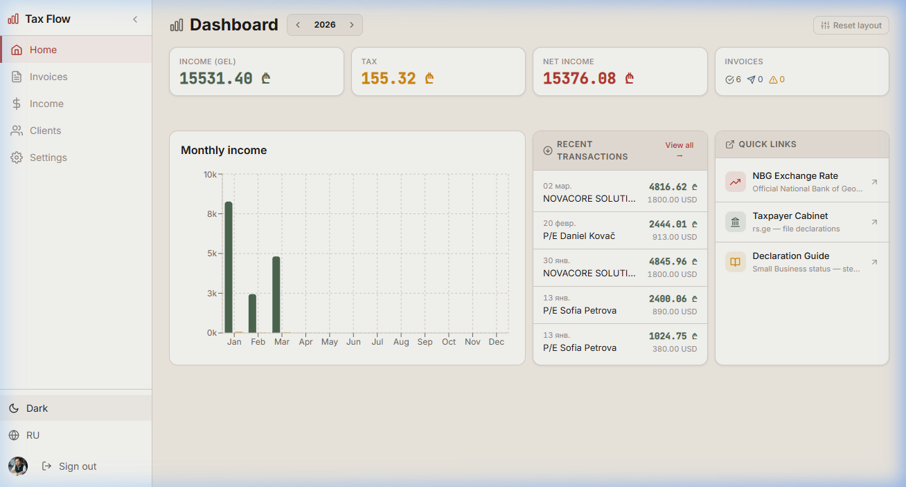 | 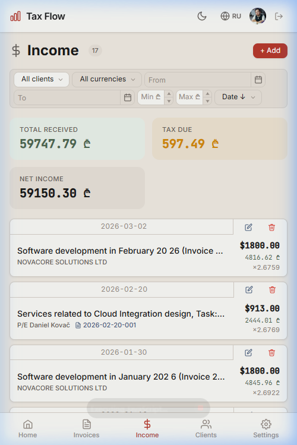 |

<details>
  <summary>📋 Invoices — Light &amp; Dark</summary>

  | Light | Dark |
  |---|---|
  | 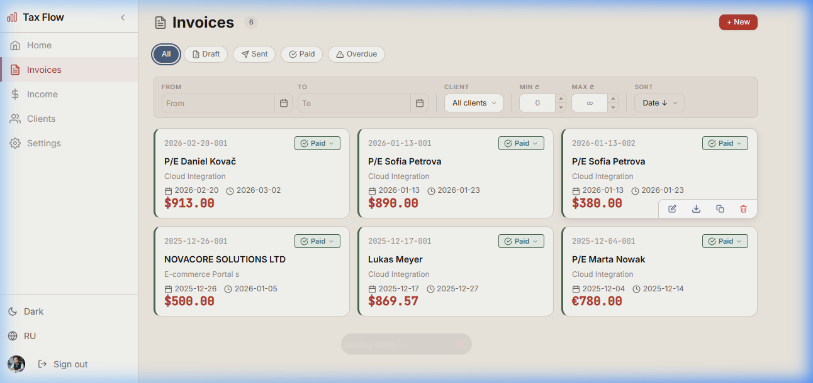 | 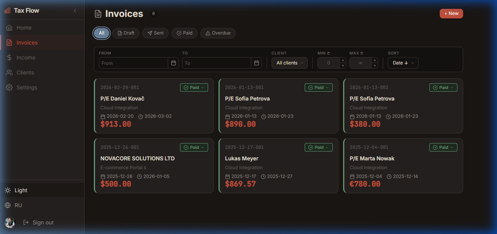 |

</details>

<details>
  <summary>💰 Income — Light &amp; Dark</summary>

  | Light | Dark |
  |---|---|
  | 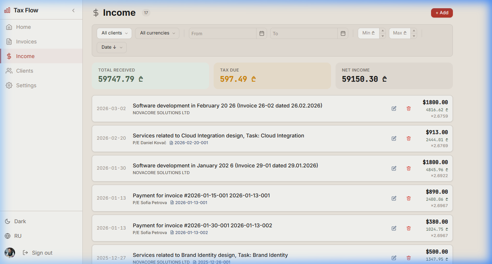 | 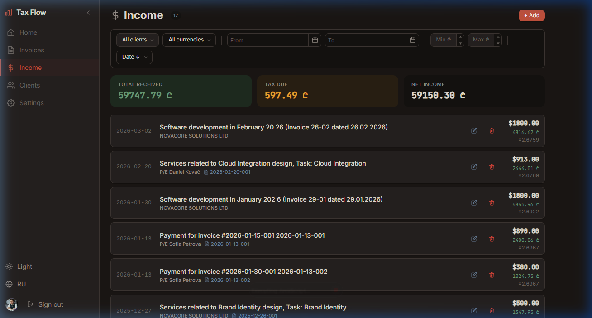 |

</details>

<details>
  <summary>🌙 Dashboard — Dark theme</summary>

  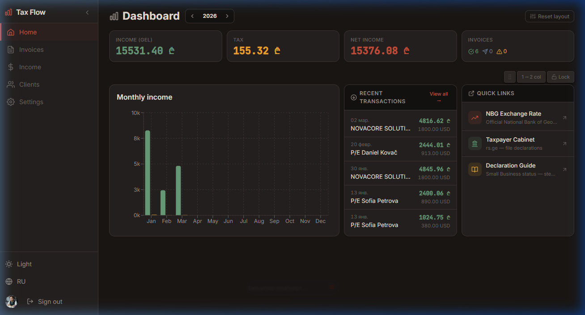

</details>

<details>
  <summary>👥 Clients · 📱 Mobile · 🔐 Login</summary>

  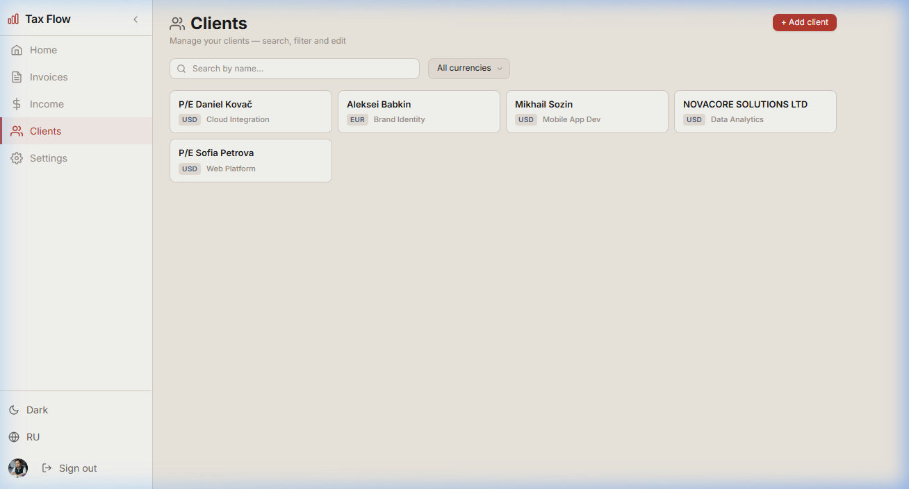

  | Invoices Mobile | Login |
  |---|---|
  | 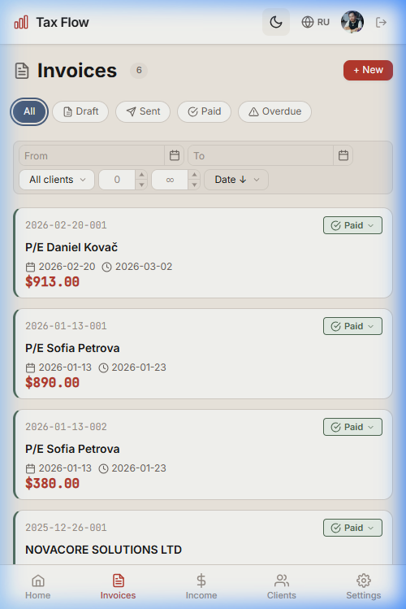 | 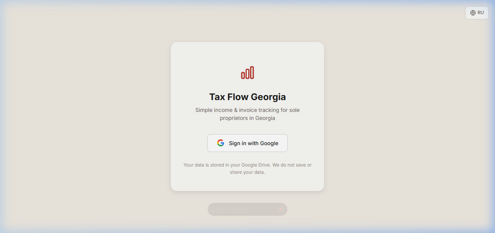 |

</details>

---

## Features

| Module | Capabilities |
|---|---|
| 🧾 **Invoices** | Create / edit / copy invoices; multi-line items; PDF generation; link to income transaction; status tracking (`draft` → `sent` → `paid`) |
| 💰 **Income (Transactions)** | Record payments; auto-fetch NBG exchange rate by date; GEL conversion; tax calculation; filter by date, client, currency |
| 👥 **Clients** | Full client directory with IBAN, bank details, default currency; used for invoice autocomplete |
| 📊 **Dashboard** | Monthly income charts; current-year tax summary; quick stats |
| ⚙️ **Settings** | IP profile (name, TIN, address, bank, IBAN, SWIFT); invoice prefix; default tax rate |
| 🌐 **Localization** | UI available in English and Russian (i18n via built-in locale system) |
| 🌙 **Theming** | Light / Dark mode toggle, persisted in localStorage |
| 📥 **Draft Auto-Save** | All forms auto-save to localStorage and restore on reload |

---

## Tech Stack

| Layer | Technology |
|---|---|
| **Framework** | React 19 + TypeScript 5.9 + Vite 8 |
| **Routing** | React Router v7 (hash-based for GitHub Pages) |
| **State Management** | Zustand 5 (auth token, UI state, toasts) |
| **Server State / Cache** | TanStack Query v5 (Google Sheets API responses) |
| **Forms & Validation** | React Hook Form v7 + Zod v4 |
| **PDF Generation** | @react-pdf/renderer v4 |
| **Charts** | Recharts v3 |
| **Date Utilities** | date-fns v4 |
| **Authentication** | Google OAuth 2.0 (implicit flow, sessionStorage token) |
| **Data Storage** | Google Sheets API v4 (user's own Drive) |
| **CI/CD** | GitHub Actions → GitHub Pages |

---

## Prerequisites

Before you begin, make sure you have:

- **Node.js** ≥ 20 installed ([nodejs.org](https://nodejs.org/))
- **npm** ≥ 10 (comes with Node.js)
- A **Google account** (to create the OAuth client and store data in your Drive)
- A **GitHub account** (for deployment via GitHub Pages — optional for local use)

---

## Getting Started

### 1. Set Up Google Cloud Project

This is a one-time setup to obtain a Google OAuth Client ID.

1. Open [Google Cloud Console](https://console.cloud.google.com/) and sign in
2. Create a new project (or select an existing one)
3. Enable the following APIs (**APIs & Services → Library**):
   - `Google Sheets API`
   - `Google Drive API`
4. Navigate to **APIs & Services → Credentials**
5. Click **Create Credentials → OAuth client ID**
6. Choose **Web application** as the application type
7. Fill in the **Authorized JavaScript origins**:
   ```
   http://localhost:5173
   https://<your-github-username>.github.io
   ```
8. Fill in the **Authorized redirect URIs**:
   ```
   http://localhost:5173/tax-flow-georgia/
   https://<your-github-username>.github.io/tax-flow-georgia/
   ```
   > **Note:** These redirect URIs are required for mobile authentication.
   > On mobile devices, the app uses OAuth redirect flow instead of popup.
   > The URI must exactly match your deployment URL (including the trailing slash).
9. Click **Create** and copy the generated **Client ID**

> ⚠️ **Important:** The OAuth consent screen must be configured. For personal use, adding yourself as a test user is sufficient — no need to go through verification.

---

### 2. Clone & Configure

```bash
# Clone the repository
git clone https://github.com/<your-username>/tax-flow-georgia.git
cd tax-flow-georgia

# Install dependencies
npm install

# Copy environment file
cp .env.example .env
```

Open `.env` and paste your Client ID:

```env
# .env
VITE_GOOGLE_CLIENT_ID=your-client-id-here.apps.googleusercontent.com
```

> The `.env` file is listed in `.gitignore` and will never be committed to version control.

---

### 3. Run Locally

```bash
npm run dev
```

Open your browser at: **[http://localhost:5173/tax-flow-georgia/](http://localhost:5173/tax-flow-georgia/)**

The first time you sign in with Google, the app will automatically create a new spreadsheet called **"Tax Flow Georgia"** in your Google Drive and set up all required sheets.

**Available npm scripts:**

| Command | Description |
|---|---|
| `npm run dev` | Start local development server |
| `npm run build` | Type-check and build for production |
| `npm run preview` | Preview the production build locally |
| `npm run lint` | Run ESLint |

---

## Project Architecture

The project follows **Feature-Sliced Design (FSD)** — a layered architecture standard for React applications that enforces strict dependency direction and clear separation of concerns.

### Layer Structure (FSD)

```
src/
├── app/                    # Application initialization
│   ├── App.tsx             # Root component: providers, router
│   ├── providers/          # AuthProvider, QueryProvider, ThemeProvider
│   ├── router.tsx          # Hash-based routing (GitHub Pages compatible)
│   └── styles/             # Design tokens, CSS reset, global styles
│
├── pages/                  # Route-level entry points (lazy-loaded)
│   ├── home/               # Dashboard page
│   ├── invoices/           # Invoices list + form
│   ├── transactions/       # Income / transactions page
│   ├── settings/           # IP profile & configuration
│   └── login/              # Authentication page
│
├── features/               # Business logic (1 directory = 1 use-case)
│   ├── auth/               # Google OAuth flow, spreadsheet initialization
│   ├── invoices/           # Invoice form, list, PDF generation
│   ├── transactions/       # Income recording, NBG rate integration
│   ├── clients/            # Client directory CRUD
│   ├── settings/           # IP profile management
│   └── dashboard/          # Charts, summary stats
│
├── entities/               # Domain models (types, Zod schemas, base queries)
│   ├── invoice/            # Invoice interface + schema + TanStack Query hook
│   ├── transaction/        # Transaction interface + schema + query hook
│   └── client/             # Client interface + schema + query hook
│
├── shared/                 # Reusable utilities (no business logic)
│   ├── ui/                 # Button, Input, Card, Modal, Toast, Calendar…
│   ├── lib/                # formatCurrency, formatDate, roundBankers
│   ├── api/
│   │   ├── sheets-client.ts  # SheetsClient — Google Sheets API wrapper
│   │   └── nbg-client.ts     # NbgRateClient — NBG exchange rate fetcher
│   ├── hooks/              # useDraftPersist, useTheme
│   └── config/             # Environment variables, constants
│
└── widgets/                # Composite UI blocks
    ├── InvoiceCard/
    ├── TransactionCard/
    └── DashboardSummary/
```

**Dependency rule:**
```
app → pages → features → entities → shared
                ↘ widgets ↗
```
Lower layers must never import from higher layers.

---

### Data Flow

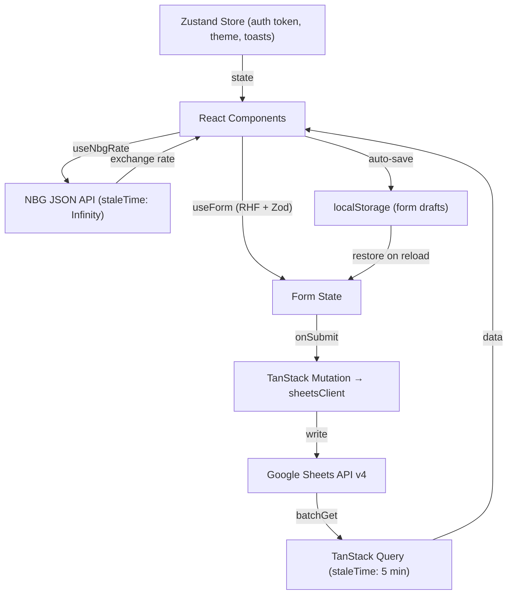

**Caching strategy:**

| Data | staleTime | gcTime | Rationale |
|---|---|---|---|
| Invoices, Transactions, Clients | 5 min | 10 min | Single user, infrequent mutations |
| Settings | 30 min | 60 min | Rarely changes |
| NBG rate (historical date) | Infinity | Infinity | Past rates never change |
| NBG rate (today) | 1 hour | 4 hours | May update during the day |

---

## Data Model

### Spreadsheet Structure

On first sign-in, the app automatically creates a spreadsheet named **"Tax Flow Georgia"** in the user's Google Drive with the following sheets:

```
Tax Flow Georgia (Spreadsheet)
├── _meta           # App metadata (schema version, creation date)
├── settings        # IP profile — 1 data row
├── clients         # Client directory
├── invoices        # Invoice headers
├── invoice_items   # Invoice line items
└── transactions    # Income records
```

### Google Sheets Sheets Overview

<details>
<summary><strong>📋 settings</strong> — IP profile (1 row)</summary>

| Column | Field | Type | Example |
|---|---|---|---|
| A | `fullName` | string | `Individual Entrepreneur Anton Filatov` |
| B | `tin` | string | `345781718` |
| C | `address` | string | `Georgia, Batumi, Tbel Abuseridze st., 38` |
| D | `email` | string | `you@example.com` |
| E | `phone` | string | `+995 555 123456` |
| F | `bankName` | string | `JSC TBC Bank, Tbilisi, Georgia` |
| G | `beneficiary` | string | `I/E Anton Filatov` |
| H | `iban` | string | `GE37TB7831445064400006` |
| I | `swift` | string | `TBCBGE22` |
| J | `defaultCurrency` | enum | `USD` / `EUR` / `GBP` / `GEL` |
| K | `taxRate` | number | `0.01` (1%) |
| L | `vatText` | string | `Zero rated` |
| M | `invoicePrefix` | string | *(optional)* |

</details>

<details>
<summary><strong>👥 clients</strong> — client directory</summary>

| Column | Field | Type | Notes |
|---|---|---|---|
| A | `id` | UUID | `crypto.randomUUID()` |
| B | `name` | string | required |
| C | `email` | string | optional |
| D | `address` | string | optional |
| E | `tin` | string | optional |
| F | `bankName` | string | optional |
| G | `iban` | string | Georgian IBAN pattern |
| H | `defaultCurrency` | enum | USD / EUR / GBP / GEL |
| I | `defaultProject` | string | autocomplete hint |
| J | `createdAt` | ISO date | auto |
| K | `updatedAt` | ISO date | auto |

</details>

<details>
<summary><strong>🧾 invoices</strong> — invoice headers</summary>

| Column | Field | Type | Notes |
|---|---|---|---|
| A | `id` | UUID | PK |
| B | `number` | string | Format: `YYYY-MM-DD-NNN` |
| C | `clientId` | UUID | FK → clients.id |
| D | `clientName` | string | denormalized for read speed |
| E | `date` | ISO date | issue date |
| F | `dueDate` | ISO date | payment deadline |
| G | `currency` | enum | |
| H–K | `subtotal`, `vatText`, `vatAmount`, `total` | number/string | |
| L | `project` | string | optional |
| M | `status` | enum | `draft` / `sent` / `paid` |
| N | `linkedTransactionId` | UUID? | FK → transactions.id |

**Invoice numbering format:** `YYYY-MM-DD-NNN`
- `NNN` = sequential counter per day (001, 002, …)
- The number is assigned on creation and **never changes** on edit

</details>

<details>
<summary><strong>💰 transactions</strong> — income records</summary>

| Column | Field | Type | Notes |
|---|---|---|---|
| A | `id` | UUID | PK |
| B | `date` | ISO date | payment received date |
| C | `month` | string | `YYYY-MM` reporting period |
| D | `clientId` | UUID? | FK → clients.id |
| E | `clientName` | string | denormalized |
| F | `linkedInvoiceId` | UUID? | FK → invoices.id |
| G | `currency` | enum | |
| H | `amount` | number | amount in source currency |
| I | `rateToGel` | number | NBG rate on payment date |
| J | `amountGel` | number | `amount × rateToGel` |
| K | `taxRate` | number | from settings |
| L | `taxGel` | number | `amountGel × taxRate` |
| M | `description` | string | optional |

**Tax calculation:**
```
amountGel = amount × rateToGel   (if currency ≠ GEL)
amountGel = amount               (if currency = GEL)
taxGel    = round(amountGel × taxRate, 2)  # Banker's rounding
```

</details>

---

## Deployment

### Automatic Deploy via GitHub Actions

Every push to the `main` branch triggers the CI/CD pipeline automatically:

```
push to main
  └── GitHub Actions
        ├── npm ci                    # Install dependencies
        ├── tsc --noEmit             # Type-check (fails build on errors)
        ├── vite build               # Production bundle
        └── Deploy to GitHub Pages   # Live in ~1 minute
```

The app is served at: `https://<your-username>.github.io/tax-flow-georgia/`

### Required GitHub Secrets

Go to **Repository → Settings → Secrets and variables → Actions → New repository secret**:

| Secret name | Value |
|---|---|
| `VITE_GOOGLE_CLIENT_ID` | Your OAuth Client ID from Google Cloud Console |

> **Why a secret?** Although the Client ID is not sensitive (it's included in the HTML page), it's good practice to keep environment variables out of the repository source code.

---

## Security

| Aspect | Implementation |
|---|---|
| **Token storage** | Access token is stored in **sessionStorage** — cleared when the tab closes, never persisted to disk |
| **OAuth scopes** | Minimal: `spreadsheets` + `drive.file` (only files created by this app) |
| **Mobile auth** | On mobile devices, OAuth uses redirect flow instead of popup for better UX. Token is intercepted before the app mounts |
| **Session expiry** | If the token expires (~60 min), the app automatically logs out and redirects to login |
| **Content Security Policy** | Configured in `index.html` to restrict resource origins |
| **No backend** | No server processes or stores your data — everything stays in your Google account |
| **No analytics** | No tracking, telemetry, or third-party scripts |

> ⚠️ **Note on data integrity:** Google Sheets does not enforce referential integrity. All foreign-key checks (clients ↔ invoices ↔ transactions) are enforced client-side. Manual edits to the spreadsheet may break links between records.

---

## NBG Exchange Rates

The app integrates with the **National Bank of Georgia (NBG)** public API to fetch official exchange rates:

- Rates are fetched **automatically** when you enter a transaction date
- Supported currencies: **USD, EUR, GBP** (converted to GEL)
- **Weekend / holiday handling:** If no rate is available for the selected date, the API falls back to the most recent available rate (up to 3 days back)
- **Offline / API unavailable:** The rate field is left empty — you can enter the rate manually
- **Caching:** Historical rates are cached indefinitely (they never change); today's rate is refreshed every hour

Exchange rates source: [nbg.gov.ge](https://nbg.gov.ge)

---

## Known Limitations

| Limitation | Details |
|---|---|
| **Single-user only** | The spreadsheet is tied to a single Google account. No multi-user collaboration |
| **No referential integrity** | Manual edits to the Google Sheet can break record links |
| **Rate limits** | Google Sheets API has a quota of 60 requests/min. The app uses batch reads to stay well within limits |
| **No offline write** | You need an internet connection to save data. Forms auto-save as drafts locally while offline |
| **GitHub Pages hosting** | The app must be deployed under a subpath (`/tax-flow-georgia/`). Changing the base path requires updating `vite.config.ts` and Google OAuth origins |
| **Mobile session** | On mobile, silent token refresh is not supported. Sessions expire after ~60 minutes, requiring re-authentication |

---

## Contributing

This is a personal tool, but contributions, suggestions, and bug reports are welcome.

1. Fork the repository
2. Create a feature branch: `git checkout -b feat/your-feature`
3. Commit your changes: `git commit -m 'feat: add your feature'`
4. Push to the branch: `git push origin feat/your-feature`
5. Open a Pull Request

Please open an [Issue](https://github.com/ant0art/tax-flow-georgia/issues) before starting significant work to align on the approach.

---

## License

[MIT](LICENSE) © 2025 Anton Filatov
