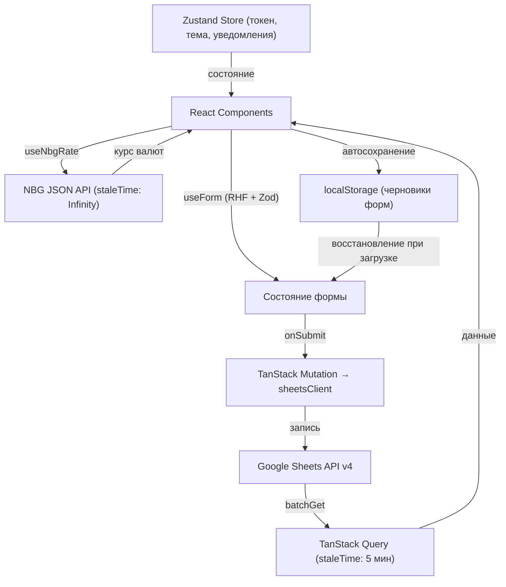

<div align="center">

# Tax Flow Georgia 🇬🇪

**Персональный финансовый инструмент для ИП в Грузии — без бэкенда.**  
Учёт доходов, выставление инвойсов и расчёт налогов — все данные хранятся в вашей Google Таблице.

[](https://github.com/ant0art/tax-flow-georgia/actions/workflows/deploy.yml) [](LICENSE) [](https://github.com/ant0art/tax-flow-georgia/commits/main) [](https://github.com/ant0art/tax-flow-georgia) [](https://github.com/ant0art/tax-flow-georgia/pulls)

[](https://react.dev) [](https://www.typescriptlang.org) [](https://vite.dev) [](https://zustand-demo.pmnd.rs) [](https://tanstack.com/query) [](https://zod.dev) [](https://developers.google.com/sheets) [](https://pages.github.com)

🌍 [English](README.md) | [Русский](README.ru.md)

</div>

---

## Содержание

- [Обзор](#обзор)
- [Скриншоты](#скриншоты)
- [Возможности](#возможности)
- [Технологии](#технологии)
- [Требования](#требования)
- [Быстрый старт](#быстрый-старт)
  - [1. Настройка Google Cloud](#1-настройка-google-cloud)
  - [2. Клонирование и конфигурация](#2-клонирование-и-конфигурация)
  - [3. Запуск локально](#3-запуск-локально)
- [Архитектура проекта](#архитектура-проекта)
  - [Структура слоёв FSD](#структура-слоёв-fsd)
  - [Поток данных](#поток-данных)
- [Модель данных](#модель-данных)
  - [Структура Spreadsheet](#структура-spreadsheet)
  - [Описание листов](#описание-листов)
- [Деплой](#деплой)
  - [Автоматический деплой через GitHub Actions](#автоматический-деплой-через-github-actions)
  - [Необходимые GitHub Secrets](#необходимые-github-secrets)
- [Безопасность](#безопасность)
- [Курсы НБГ](#курсы-нбг)
- [Известные ограничения](#известные-ограничения)
- [Contributing](#contributing)
- [Лицензия](#лицензия)

---

## Скриншоты

| Дашборд | Мобильная версия |
|---|---|
|  |  |

<details>
<summary>📋 Инвойсы</summary>

| Светлая | Тёмная |
|---|---|
|  |  |

</details>

<details>
<summary>💰 Доходы</summary>

| Светлая | Тёмная |
|---|---|
|  |  |

</details>

<details>
<summary>🏠 Дашборд (тёмная)</summary>


</details>

<details>
<summary>👥 Клиенты · 📱 Инвойсы (mobile) · 🔐 Вход</summary>


| Инвойсы (mobile) | Страница входа |
|---|---|
|  |  |

</details>

---

## Обзор

**Tax Flow Georgia** — это клиентский SPA для индивидуальных предпринимателей (ИП), зарегистрированных в Грузии. Здесь нет бэкенда, базы данных или сторонних хранилищ — все данные находятся в Google Spreadsheet, который принадлежит вам лично и доступен через Google Sheets API v4.

Приложение автоматизирует повседневный финансовый workflow фрилансера:

1. **Фиксация дохода** от клиентов в нескольких валютах (USD, EUR, GBP, CHF, CZK, PLN, GEL и др.)
2. **Выставление профессиональных инвойсов** с экспортом в PDF
3. **Автоматическая конвертация** сумм в GEL по официальному курсу НБГ
4. **Расчёт 1% налога** согласно требованиям для ИП с малым оборотом в Грузии
5. **Ведение справочника клиентов** с банковскими реквизитами для автозаполнения инвойсов

> **Почему Google Sheets?**  
> Это даёт полный контроль над данными, нулевую стоимость хостинга, простой аудит и возможность расширить таблицу по своему усмотрению.

---

## Возможности

| Модуль | Возможности |
|---|---|
| 🧾 **Инвойсы** | Создание / редактирование / копирование инвойсов; несколько позиций; генерация PDF; привязка к транзакции; статусы (`draft` → `sent` → `paid`) |
| 💰 **Доходы (транзакции)** | Запись платежей; автозагрузка курса НБГ по дате; конвертация в GEL; расчёт налога; фильтрация по дате, клиенту, валюте |
| 👥 **Клиенты** | Полный справочник контрагентов с IBAN, банковскими реквизитами, валютой по умолчанию; используется для автозаполнения |
| 📊 **Дашборд** | Графики доходов по месяцам; налоговый итог за год; сводная статистика |
| ⚙️ **Настройки** | Профиль ИП (имя, ИИН, адрес, банк, IBAN, SWIFT); префикс инвойса; ставка налога |
| 🌐 **Локализация** | Интерфейс на английском и русском языках |
| 🌙 **Темы** | Светлая / Тёмная тема, сохраняется в localStorage |
| 📥 **Автосохранение черновиков** | Все формы сохраняются в localStorage и восстанавливаются при перезагрузке |

---

## Технологии

| Слой | Технология |
|---|---|
| **Фреймворк** | React 19 + TypeScript 5.9 + Vite 8 |
| **Роутинг** | React Router v7 (hash-режим для GitHub Pages) |
| **State Management** | Zustand 5 (токен авторизации, UI-состояние, уведомления) |
| **Server State / Кэш** | TanStack Query v5 (ответы Google Sheets API) |
| **Формы и валидация** | React Hook Form v7 + Zod v4 |
| **Генерация PDF** | @react-pdf/renderer v4 |
| **Графики** | Recharts v3 |
| **Работа с датами** | date-fns v4 |
| **Аутентификация** | Google OAuth 2.0 (implicit flow, токен в sessionStorage) |
| **Хранение данных** | Google Sheets API v4 (Google Drive пользователя) |
| **CI/CD** | GitHub Actions → GitHub Pages |

---

## Требования

Перед началом убедитесь, что у вас есть:

- **Node.js** ≥ 20 ([nodejs.org](https://nodejs.org/))
- **npm** ≥ 10 (входит в состав Node.js)
- **Google аккаунт** (для создания OAuth-клиента и хранения данных в Drive)
- **GitHub аккаунт** (для деплоя через GitHub Pages — необязательно для локального использования)

---

## Быстрый старт

### 1. Настройка Google Cloud

Это одноразовая настройка для получения Google OAuth Client ID.

1. Откройте [Google Cloud Console](https://console.cloud.google.com/) и войдите в аккаунт
2. Создайте новый проект или выберите существующий
3. Включите следующие API (**APIs & Services → Library**):
   - `Google Sheets API`
   - `Google Drive API`
4. Перейдите в **APIs & Services → Credentials**
5. Нажмите **Create Credentials → OAuth client ID**
6. Тип приложения: **Web application**
7. Заполните **Authorized JavaScript origins**:
   ```
   http://localhost:5173
   https://<ваш-github-username>.github.io
   ```
8. Заполните **Authorized redirect URIs**:
   ```
   http://localhost:5173
   https://<ваш-github-username>.github.io/tax-flow-georgia/
   ```
9. Нажмите **Create** и скопируйте **Client ID**

> ⚠️ **Важно:** Необходимо настроить OAuth consent screen. Для личного использования достаточно добавить себя в качестве тестового пользователя — проверка Google не требуется.

---

### 2. Клонирование и конфигурация

```bash
# Клонировать репозиторий
git clone https://github.com/<your-username>/tax-flow-georgia.git
cd tax-flow-georgia

# Установить зависимости
npm install

# Скопировать файл окружения
cp .env.example .env
```

Откройте `.env` и вставьте ваш Client ID:

```env
# .env
VITE_GOOGLE_CLIENT_ID=your-client-id-here.apps.googleusercontent.com
```

> Файл `.env` добавлен в `.gitignore` и никогда не будет закоммичен в репозиторий.

---

### 3. Запуск локально

```bash
npm run dev
```

Откройте браузер по адресу: **[http://localhost:5173/tax-flow-georgia/](http://localhost:5173/tax-flow-georgia/)**

При первом входе через Google приложение автоматически создаст таблицу **"Tax Flow Georgia"** в вашем Google Drive и настроит все необходимые листы.

**Доступные команды npm:**

| Команда | Описание |
|---|---|
| `npm run dev` | Запустить локальный сервер разработки |
| `npm run build` | Проверка типов и сборка для production |
| `npm run preview` | Предпросмотр production-сборки |
| `npm run lint` | Запустить ESLint |

---

## Архитектура проекта

Проект следует **Feature-Sliced Design (FSD)** — стандарту слоёной архитектуры для React-приложений, который обеспечивает строгое направление зависимостей и чёткое разделение ответственности.

### Структура слоёв FSD

```
src/
├── app/                    # Инициализация приложения
│   ├── App.tsx             # Корневой компонент: провайдеры, роутер
│   ├── providers/          # AuthProvider, QueryProvider, ThemeProvider
│   ├── router.tsx          # Hash-based роутинг (совместим с GitHub Pages)
│   └── styles/             # Токены дизайна, CSS reset, глобальные стили
│
├── pages/                  # Точки входа маршрутов (lazy-load)
│   ├── home/               # Дашборд
│   ├── invoices/           # Список инвойсов + форма
│   ├── transactions/       # Доходы / транзакции
│   ├── settings/           # Настройки профиля ИП
│   └── login/              # Страница авторизации
│
├── features/               # Бизнес-логика (1 директория = 1 use-case)
│   ├── auth/               # Google OAuth flow, инициализация таблицы
│   ├── invoices/           # Форма инвойса, список, генерация PDF
│   ├── transactions/       # Запись доходов, интеграция с НБГ
│   ├── clients/            # CRUD справочника клиентов
│   ├── settings/           # Управление профилем ИП
│   └── dashboard/          # Графики, сводная статистика
│
├── entities/               # Доменные модели (типы, схемы Zod, базовые запросы)
│   ├── invoice/            # Интерфейс Invoice + схема + TanStack Query хук
│   ├── transaction/        # Интерфейс Transaction + схема + хук
│   └── client/             # Интерфейс Client + схема + хук
│
├── shared/                 # Переиспользуемые утилиты (без бизнес-логики)
│   ├── ui/                 # Button, Input, Card, Modal, Toast, Calendar…
│   ├── lib/                # formatCurrency, formatDate, roundBankers
│   ├── api/
│   │   ├── sheets-client.ts  # SheetsClient — обёртка над Google Sheets API
│   │   └── nbg-client.ts     # NbgRateClient — получение курсов НБГ
│   ├── hooks/              # useDraftPersist, useTheme
│   └── config/             # Переменные окружения, константы
│
└── widgets/                # Составные UI-блоки
    ├── InvoiceCard/
    ├── TransactionCard/
    └── DashboardSummary/
```

**Правило зависимостей:**
```
app → pages → features → entities → shared
                ↘ widgets ↗
```
Нижние слои никогда не импортируют верхние.

---

### Поток данных



**Стратегия кэширования:**

| Данные | staleTime | gcTime | Обоснование |
|---|---|---|---|
| Инвойсы, Транзакции, Клиенты | 5 мин | 10 мин | Один пользователь, редкие изменения |
| Настройки | 30 мин | 60 мин | Меняются крайне редко |
| Курс НБГ (историческая дата) | Infinity | Infinity | Прошлые курсы не меняются |
| Курс НБГ (сегодня) | 1 час | 4 часа | Может обновиться в течение дня |

---

## Модель данных

### Структура Spreadsheet

При первом входе приложение автоматически создаёт таблицу **"Tax Flow Georgia"** в Google Drive пользователя со следующими листами:

```
Tax Flow Georgia (Spreadsheet)
├── _meta           # Метаданные приложения (версия схемы, дата создания)
├── settings        # Профиль ИП — 1 строка данных
├── clients         # Справочник клиентов
├── invoices        # Заголовки инвойсов
├── invoice_items   # Позиции инвойсов
└── transactions    # Записи доходов
```

### Описание листов

<details>
<summary><strong>📋 settings</strong> — профиль ИП (1 строка)</summary>

| Колонка | Поле | Тип | Пример |
|---|---|---|---|
| A | `fullName` | string | `Individual Entrepreneur Anton Filatov` |
| B | `tin` | string | `345781718` |
| C | `address` | string | `Georgia, Batumi, ул. Tbel Abuseridze, 38` |
| D | `email` | string | `you@example.com` |
| E | `phone` | string | `+995 555 123456` |
| F | `bankName` | string | `JSC TBC Bank, Tbilisi, Georgia` |
| G | `beneficiary` | string | `I/E Anton Filatov` |
| H | `iban` | string | `GE37TB7831445064400006` |
| I | `swift` | string | `TBCBGE22` |
| J | `defaultCurrency` | enum | `USD` / `EUR` / `GBP` / `GEL` |
| K | `taxRate` | number | `0.01` (1%) |
| L | `vatText` | string | `Zero rated` |
| M | `invoicePrefix` | string | *(необязательно)* |

</details>

<details>
<summary><strong>👥 clients</strong> — справочник клиентов</summary>

| Колонка | Поле | Тип | Примечание |
|---|---|---|---|
| A | `id` | UUID | `crypto.randomUUID()` |
| B | `name` | string | обязательное |
| C | `email` | string | необязательное |
| D | `address` | string | необязательное |
| E | `tin` | string | необязательное |
| F | `bankName` | string | необязательное |
| G | `iban` | string | грузинский формат IBAN |
| H | `defaultCurrency` | enum | USD / EUR / GBP / GEL |
| I | `defaultProject` | string | подсказка для автозаполнения |
| J | `createdAt` | ISO date | авто |
| K | `updatedAt` | ISO date | авто |

</details>

<details>
<summary><strong>🧾 invoices</strong> — заголовки инвойсов</summary>

| Колонка | Поле | Тип | Примечание |
|---|---|---|---|
| A | `id` | UUID | PK |
| B | `number` | string | Формат: `YYYY-MM-DD-NNN` |
| C | `clientId` | UUID | FK → clients.id |
| D | `clientName` | string | денормализация для быстрого чтения |
| E | `date` | ISO date | дата выставления |
| F | `dueDate` | ISO date | срок оплаты |
| G | `currency` | enum | |
| H–K | `subtotal`, `vatText`, `vatAmount`, `total` | number/string | |
| L | `project` | string | необязательное |
| M | `status` | enum | `draft` / `sent` / `paid` |
| N | `linkedTransactionId` | UUID? | FK → transactions.id |

**Нумерация инвойсов:** `YYYY-MM-DD-NNN`
- `NNN` = порядковый счётчик за день (001, 002, …)
- Номер присваивается при создании и **никогда не меняется** при редактировании

</details>

<details>
<summary><strong>💰 transactions</strong> — запись доходов</summary>

| Колонка | Поле | Тип | Примечание |
|---|---|---|---|
| A | `id` | UUID | PK |
| B | `date` | ISO date | дата получения платежа |
| C | `month` | string | `YYYY-MM` отчётный период |
| D | `clientId` | UUID? | FK → clients.id |
| E | `clientName` | string | денормализация |
| F | `linkedInvoiceId` | UUID? | FK → invoices.id |
| G | `currency` | enum | |
| H | `amount` | number | сумма в исходной валюте |
| I | `rateToGel` | number | курс НБГ на дату платежа |
| J | `amountGel` | number | `amount × rateToGel` |
| K | `taxRate` | number | из настроек |
| L | `taxGel` | number | `amountGel × taxRate` |
| M | `description` | string | необязательное |

**Расчёт налога:**
```
amountGel = amount × rateToGel   (если валюта ≠ GEL)
amountGel = amount               (если валюта = GEL)
taxGel    = round(amountGel × taxRate, 2)  # Банкирское округление
```

</details>

---

## Деплой

### Автоматический деплой через GitHub Actions

Каждый push в ветку `main` автоматически запускает CI/CD pipeline:

```
push в main
  └── GitHub Actions
        ├── npm ci                    # Установка зависимостей
        ├── tsc --noEmit             # Проверка типов (ошибки останавливают сборку)
        ├── vite build               # Production-бандл
        └── Deploy to GitHub Pages   # Публикация (~1 минута)
```

Приложение будет доступно по адресу: `https://<your-username>.github.io/tax-flow-georgia/`

### Необходимые GitHub Secrets

Перейдите в **Repository → Settings → Secrets and variables → Actions → New repository secret**:

| Название секрета | Значение |
|---|---|
| `VITE_GOOGLE_CLIENT_ID` | Ваш OAuth Client ID из Google Cloud Console |

---

## Безопасность

| Аспект | Реализация |
|---|---|
| **Хранение токена** | Access token хранится в **sessionStorage** — очищается при закрытии вкладки, не сохраняется на диск между сессиями |
| **OAuth scopes** | Минимальные: `spreadsheets` + `drive.file` (только файлы, созданные этим приложением) |
| **Content Security Policy** | Настроена в `index.html` для ограничения источников ресурсов |
| **Нет бэкенда** | Никакой сервер не обрабатывает и не хранит ваши данные — всё остаётся в вашем Google аккаунте |
| **Нет аналитики** | Никакого трекинга, телеметрии или сторонних скриптов |

> ⚠️ **Примечание о целостности данных:** Google Sheets не поддерживает referential integrity. Все проверки FK (clients ↔ invoices ↔ transactions) выполняются на стороне клиента. Ручное редактирование таблицы может нарушить связи между записями.

---

## Курсы НБГ

Приложение интегрируется с публичным API **Национального Банка Грузии (НБГ)** для получения официальных курсов валют:

- Курс загружается **автоматически** при вводе даты транзакции
- Поддерживаемые валюты: **USD, EUR, GBP** (конвертируются в GEL)
- **Выходные / праздники:** если курс на выбранную дату недоступен, используется последний доступный (до 3 дней назад)
- **Нет соединения / API недоступен:** поле курса остаётся пустым — можно ввести вручную
- **Кэширование:** исторические курсы кэшируются бессрочно; курс на сегодня обновляется каждый час

Источник курсов: [nbg.gov.ge](https://nbg.gov.ge)

---

## Известные ограничения

| Ограничение | Подробности |
|---|---|
| **Один пользователь** | Таблица привязана к одному Google-аккаунту. Совместная работа не поддерживается |
| **Нет referential integrity** | Ручное редактирование Google Таблицы может нарушить связи между записями |
| **Лимиты API** | Google Sheets API допускает 60 запросов/мин. Приложение использует batch-читение, чтобы оставаться в лимитах |
| **Нет записи в офлайн** | Для сохранения данных нужно интернет-соединение. Формы сохраняются как черновики локально |
| **Хостинг на GitHub Pages** | Приложение должно быть развёрнуто по подпути (`/tax-flow-georgia/`). Изменение базового пути требует обновления `vite.config.ts` и OAuth origins в Google Cloud |

---

## Contributing

Это персональный инструмент, но предложения, баг-репорты и PR приветствуются.

1. Сделайте форк репозитория
2. Создайте ветку: `git checkout -b feat/your-feature`
3. Закоммитьте изменения: `git commit -m 'feat: add your feature'`
4. Запушьте ветку: `git push origin feat/your-feature`
5. Откройте Pull Request

Пожалуйста, создайте [Issue](https://github.com/ant0art/tax-flow-georgia/issues) перед началом значительных изменений — чтобы согласовать подход.

---

## Лицензия

[MIT](LICENSE) © 2025 Anton Filatov
